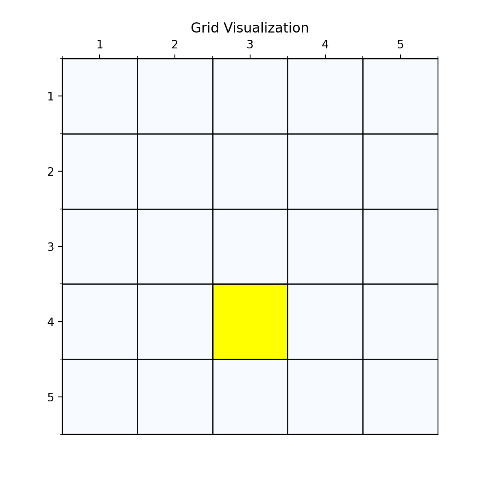
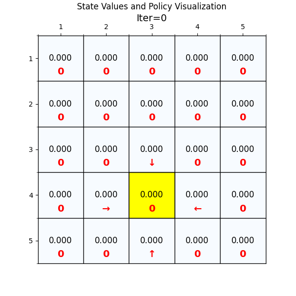
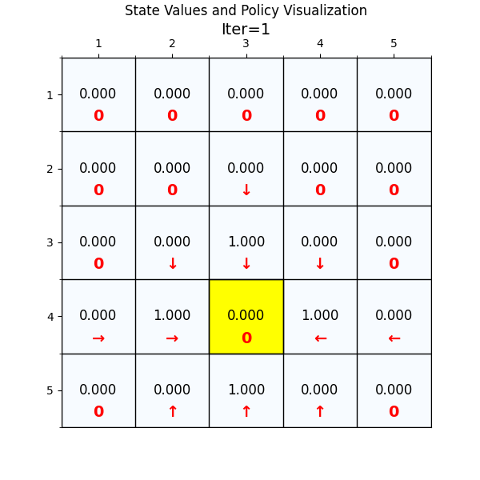
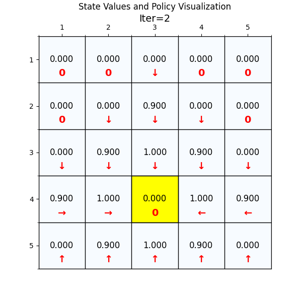
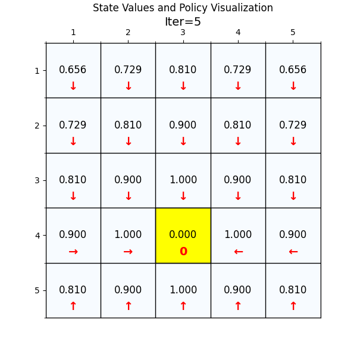

# 强化学习中值迭代算法的实现
### 重点 
算法实现的重点是理解：值迭代算法和策略迭代算法都是交替进行**value update**和**policy update**，来求解最优策略。 
两个策略的原理具体可以参考文章 
[什么是值迭代和策略迭代算法？](https://zhuanlan.zhihu.com/p/1887821778711201581)

---

### 一、算法通俗讲解
**目标**：通过交替评估当前策略的性能并改进策略，最终找到最优策略（在每个状态下选择长期收益最大的动作）。

---
#### **核心概念**
1. **算法迭代链路**： $$  \pi_{0} \to V^{\pi_{0}}_{0} \to V^{\pi_{0}}_{1} \to V^{\pi_{0}}_{2} \dots  \to V^{\pi_{0}}_{n} \to \pi_{1} \to V^{\pi_{1}}_{0} \to V^{\pi_{1}}_{1} \to V^{\pi_{1}}_{2} \dots  \to V^{\pi_{1}}_{n}  \to \pi_{2} \to\dots \to \pi_{k}$$
这个算法是一个两层迭代的算法：  
**第一层迭代**是：$\pi_{0} \to \dots \to \pi_{k} $  
这个是策略的k次迭代，每次迭代之后，我们就会得到一个更好的策略，直至策略不再变化。    
每次迭代k里面，包含**第2层迭代**：$V^{\pi_{k}}_{0} \to V^{\pi_{k}}_{1} \to V^{\pi_{k}}_{2} \dots  \to V^{\pi_{k}}_{n} $   
这个是在指定策略$\pi_{k}$的情况下，利用贝尔曼方程求解价值函数（state value）的过程。
求解state value的目的是为了求出下一轮的策略$\pi_{k+1}$   
刚才的迭代链路也可以简化成： $$  \pi_{0} \to  V^{\pi_{0}}_{n} \to \pi_{1} \to  V^{\pi_{1}}_{n}  \to \pi_{2} \to\dots \to \pi_{k}$$
其中V代表每轮迭代中价值函数（state value），π代表策略。 
2. **已知条件** 
   1. **初始化的状态值函数 V(s)**：表示从状态 `s` 出发，长期能获得的累计奖励期望。
   2. **状态转移概率 P(s'|s,a)**：在状态 `s` 执行动作 `a` 后，转移到状态 `s'` 的概率。
   3. **奖励分布 p(r|s,a)**：在状态 `s` 执行动作 `a` 后，获得即时奖励 `r` 的概率。
3. **未知条件（要求解的值）** 
   1. **状态值函数 $V^{\pi_{k}}_{n}$**：表示在策略$\pi_{k}$下，最优的状态值函数。
   2. **策略（Policy）π(a|s)**：表示在状态 `s` 下选择动作 `a` 的概率。

---

### 二、算法流程  
1. **初始化**  
   - 随机初始化策略 `π`（如均匀分布）。  
   - 初始化状态值函数 `V(s) = 0`。
   
2. **循环更新直至策略稳定**  
   重复以下步骤，直到策略不再变化：
```python
for iter in range(max_iter):
    #step1:策略评估, 根据策略更新state value
    V = policy_eva(policy, V)

    #step2：策略更新, policy update
    new_policy = policy_improvement(V)

    #检查策略是否稳定
    If equal(new_policy, policy):
        Break
    Policy = new_policy
```
- **step1：策略评估**  
     迭代计算当前策略 `π` 下的状态值函数 `V(s)`，直至收敛：（贝尔曼方程的求解）  
     $$
     V_{\text{new}}(s) = G_{t} + \gamma V(s')
     $$  
     更新 $V(s) = V_{\text{new}}(s)$，直到两次迭代的差值小于阈值。  

```python
def  policy_eva(polic, V):
    delta = 0
    while delta < theta:
        #迭代结束条件：值函数收敛，不再变化
        new_V = V.copy()
        for s in states:
            #根据策略函数选择action
            action = policy(s)
            #得到下一个状态
            next_state = get_next_state(state, action)
            #贝尔曼方程更新
            new_value = reward + gamma*V[next_state]
            new_V[state] = new_value
            delta = max(abs(new_V[s]-V[s]), delta)
        V = new_V
    return V
```
- **step2：策略改进**  
     对每个状态 `s`，选择使动作值 `Q(s,a)` 最大的动作：  
     $$
     \pi_{\text{new}}(a|s) = 
     \begin{cases} 
     1 & \text{if } a = a^* =\arg\max_{a} Q(s,a) \\
     0 & \text{otherwise}
     \end{cases}
     $$  
     其中，$a^*$代表我们找到价值最大的动作。动作值 `Q(s,a)` 的计算公式为：  
     $$
     Q(s,a) = \sum_{s'} P(s'|s,a) \left[ r + \gamma V(s') \right]
     $$

```python
def  policy_improvement(polic, V):
    for s in states:
        max_value = -np.inf
        #遍历所有action找到动作价值函数最大的best_action
        for action in actions:
            next_state,reward = get_next_state(s,action)
            value = reward + gamma*V[next_state]
            if value > max_value:
                max_value = value
                best_action = action
        #更新策略函数，只选择best_action，其他action概率为0
        policy[s] = best_action
    return policy
```

3. **终止条件**  
   当策略 `π` 在两次迭代中完全相同时，算法终止。

---

#### **与值迭代的区别**  
- **策略迭代**：显式维护策略，分“评估-改进”两步，需多次迭代策略评估，但策略改进更快。  
- **值迭代**：隐式更新策略，直接通过最大化动作值更新 `V(s)`，计算更高效。  

---

### 三、算法的Python代码实现  
```python
def policy_iteration(S, A, P, R, gamma, threshold=1e-6):
    # 初始化策略（均匀分布）
    policy = {s: {a: 1/len(A) for a in A} for s in S}
    V = {s: 0 for s in S}
    policy_stable = False

    while not policy_stable:
        # 策略评估：计算当前策略下的 V(s)
        while True:
            delta = 0
            V_new = {}
            for s in S:
                v = 0
                for a in A:
                    q = sum(P(s, a, s_prime) * (R(s, a, s_prime) + gamma * V[s_prime])
                            for s_prime in S)
                    v += policy[s][a] * q  # 加权求和（策略概率 * 动作值）
                V_new[s] = v
                delta = max(delta, abs(V_new[s] - V[s]))
            V = V_new
            if delta < threshold:
                break

        # 策略改进：贪心更新策略
        policy_stable = True
        for s in S:
            old_action = max(policy[s], key=policy[s].get)  # 原策略选择的动作
            q_values = [sum(P(s, a, s_prime) * (R(s, a, s_prime) + gamma * V[s_prime])
                        for s_prime in S) for a in A]
            best_a = np.argmax(q_values)
            # 更新为确定性策略
            new_policy = {a: 0 for a in A}
            new_policy[best_a] = 1
            if new_policy != policy[s]:
                policy_stable = False
            policy[s] = new_policy

    return V, policy
```

---

#### **关键注意事项**  
1. **策略评估的收敛性**：需多次迭代贝尔曼方程，确保 `V(s)` 精确反映当前策略。  
2. **策略稳定性判断**：若策略不再变化，说明已达到最优。  
3. **计算效率**：策略评估可能耗时较长，可通过动态规划或截断迭代优化。  
4. **折扣因子 γ**：与值迭代相同，控制未来奖励的权重（通常取 0.9~0.99）。  


---
### 四、一个简单的网格世界例子  
网格世界中，**agent**需要找到到达终点的最优策略。  
首先我们有第一种最简单的网格，就是只有一个终点，并且奖励函数也比较简单，到达终点奖励1，其他状态奖励0。
<div style="display: flex; gap: 10px;">
  <figure style="margin: 0; flex: 1;">
    
    <figcaption style="text-align: center; font-size: 0.9em; color: #666;">图1：最简单的网格</figcaption>
  </figure>

  <figure style="margin: 0; flex: 1;">
    
    <figcaption style="text-align: center; font-size: 0.9em; color: #666;">图2：1轮迭代后的state value分布和策略</figcaption>
  </figure>
</div>
那么我们现在开始在这个网格上运行这个算法，看一下state value和policy的变化。 





  
这个网格世界比较简单，我们只用5个迭代就找到了最优策略。  

### 五、一个复杂的网格世界例子  
下面我们换一个复杂的网格世界，看下policy 迭代算法怎么找到最优路径。  
<div style="display: flex; gap: 10px;">
  <figure style="margin: 0; flex: 1;">
    
    <figcaption style="text-align: center; font-size: 0.9em; color: #666;">图3：最优策略和state value</figcaption>
  </figure>
  <figure style="margin: 0; flex: 1;">
    
    <figcaption style="text-align: center; font-size: 0.9em; color: #666;">图4：网格世界升级版GridV3</figcaption>
  </figure>
</div>
如图4所示，这个就是我们网格世界的升级版GridV3，这个和上个网格的区别是，增加了禁止区域(红色网格，agent进入之后会获得的奖励分数是负的)，
增加了边界检测（agent试图突破边界时，获得的奖励也是负的）。