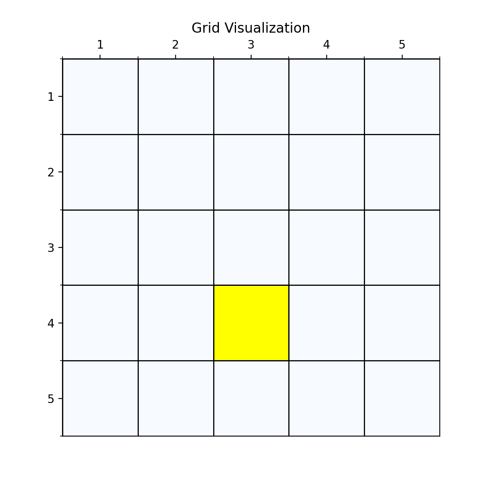

# 强化学习中值迭代算法的实现
### 重点 
算法实现的重点是理解：值迭代算法和策略迭代算法都是交替进行**value update**和**policy update**，来求解最优策略。 
两个策略的原理具体可以参考文章 
[什么是值迭代和策略迭代算法？](https://zhuanlan.zhihu.com/p/1887821778711201581)

---

### 一、算法通俗讲解
**目标**：通过不断更新状态的价值函数，最终找到最优策略（即在每个状态下选择收益最大的动作）。

---

#### **核心概念**
**迭代链路**：$ V_{0} \to \pi_{0} \to V_{1}\to \pi_{1}\dots $ <br>
其中V代表每轮迭代中状态的state value，π代表策略。  
已知条件  
1. **初始化的状态值函数 V(s)**：表示从状态 `s` 出发，长期能获得的累计奖励期望。
2. **状态转移概率 P(s'|s,a)**：在状态 `s` 执行动作 `a` 后，转移到状态 `s'` 的概率。
3. **奖励分布 p(r|s,a)**：在状态 `s` 执行动作 `a` 后，获得即时奖励 `r` 的概率。

未知条件 
1. **动作值函数 q(s,a)**：表示在状态 `s` 下执行动作 `a` 后，能获得的累计奖励期望。

**值迭代算法伪代码** <br>
1. **初始化**  
   对所有状态 `s`，设定初始值 `V(s) = 0`（或随机值）。

2. **循环更新直至收敛**  


里面的变量V代表state value，在每轮迭代中的值都不一样，实际编程需要加上迭代轮次k。  
**停止迭代的条件**，是评估两轮之间的V的差值是否足够小，$\theta$ 是一个很小的数，实际计算是通过求差值的最大值小于$\theta$来实现控制条件$ \left \| V_{k+1} - V_{k} \right \| \le \theta $求的是。 

---

### 二、python实现
```python

def value_iteration(grid, theta=1e-4, max_iter = 1000):
    #值迭代算法
    #初始化state 函数
    V = np.zeros((grid.rows, grid.cols))

    for Iter in range(max_iter):
        delta = 0
        new_V = np.copy(V)
        print("---------Iter------------", Iter)
        for i in range(grid.rows):
            for j in range(grid.cols):
                state = (i,j)
                if state in grid.terminal_states:
                    #终止状态不更新 
                    #动作为原地不动
                    new_V[i,j] = 1.0 + grid.gamma*V[i,j]
                    continue
                #计算所有可能动作的值函数
                max_value = -np.inf
                for action in grid.actions:
                    next_state = grid.get_next_state(state, action)
                    reward = grid.get_reward(state, next_state, action)
                    #贝尔曼最优方程更新 求解statue value
                    value = reward + grid.gamma * V[next_state]
                    if value > max_value:
                        max_value = value
                new_V[i,j] = max_value
                delta = max(delta, abs(new_V[i,j]-V[i,j]))
                
        #打印当前state value和策略
        V = np.copy(new_V)
        print("当前的state value：\n",V)
        iter_policy = extract_policy(grid, V)
        print("当前策略：\n", iter_policy)
        print("debug delta", delta)
        if delta < theta:
            break
    return V

```
value_iteration函数是我们的值迭代算法的核心代码。现在我们以网格世界为例子，了解这个算法是怎么找到最优策略的。

---

### 三、一个简单的网格世界例子
网格世界中，**agent**需要找到到达终点的最优策略。  
首先我们有第一种最简单的网格，就是只有一个终点，并且奖励函数也比较简单，到达终点奖励1，其他状态奖励0。
<div style="display: flex; gap: 10px;">
  <figure style="margin: 0; flex: 1;">
    
    <figcaption style="text-align: center; font-size: 0.9em; color: #666;">图1：最简单的网格</figcaption>
  </figure>

  <figure style="margin: 0; flex: 1;">
    
    <figcaption style="text-align: center; font-size: 0.9em; color: #666;">图2：1轮迭代后的state value分布和策略</figcaption>
  </figure>
</div>
那么我们现在开始在这个网格上运行这个算法，看一下state value和policy的变化。

从图2中可以看到，经过一次迭代之后，部分网格中的state value已经从初始值0改变为1.0。  
网格中的箭头，代表agent在这个state找到的最优方向，没有箭头的代表算法现在还没有计算到。  
我们可以看到刚开始的时候，大部分state value都是0。state value=1.0的网格有五个，坐标分别是(3,3),(4,2),(4,4),(5,3)和终点(4,3)。  
那么为什么1轮迭代之后，**这些网格的state value是1.0呢？**   
下面我们通过代码和贝尔曼方程计算一下。
首先从上节课回顾**state value**的定义：  
> 状态价值函数：state value function也叫做**state value 对应标识V ，这个V和状态函数s和策略π有关，代表在给定策略π的情况下，状态s的期望价值（从当前状态开始到最终状态时走完一条trace，agent所获得的累加回报的期望。）  
return的定义：return是从某个时刻开始，agent未来获得的所有奖励的累计值。在数学上用Gt表示。  
> 公式如下：  
> $$ 
G_{t}= R_{t+1}+\gamma R_{t+2}+\gamma^2 R_{t+3} + \dots   
$$
> 
先看下终点网格(4,3)，由于是终点，所以及时奖励$R_{t+1}=1$，当agent到达终点时，我们肯定是期望agent保持在这个位置，所以$R_{t+2},R_{t+3}$都是对应状态(4,3)的value，由于初始化V=0，第一轮迭代时，$V_{0}[4,3]=0$ 
所以
$$
\begin{align}
V_{1}[4,3] &=1+\gamma V_{0}[4,3] + \gamma^2 V_{0}[4,3] + \dots  \\
&=1+0+0 + \dots  \\
&=1
\end{align}
$$
在看下网格(3,3),由于策略是向下，所以及时奖励$R_{t+1}=1$，由于初始化V=0，第一轮迭代时，$V_{0}=0$ 所以$R_{t+2},R_{t+3}$无论是哪个状态s的value 值都是0。
$$
\begin{align}
V_{1}[3,3] &=1+\gamma R_{t+2}+\gamma^2 R_{t+3} + \dots  \\
&=1+0+0 + \dots  \\
&=1
\end{align}
$$
对应网格(3,3)我们可以看到如果agent选择其他动作（'0','↑', '←', '→'）对应的及时奖励都是0，所以按照value 迭代的算法，策略会被更新为奖励最大的动作，即'↓'，也是图2中展示的策略。  
同样对应其他网格(4,2),(4,4),(5,3)可以同样计算。
<div style="display: flex; gap: 10px;">
  
  
  
</div>
<div style="display: flex; gap: 10px;">
  
  
  
</div>
在iter=40的时候，delta已经是0.0147，代表两轮算法之间state value变化已经很小了。
<div style="display: flex; gap: 10px;">
  
  
  
</div>

最终经过88次迭代之后，delta已经到了我们规定的最小值，state value也基本上没有变化了，说明我们已经找到了最优值。下面看一下最优策略和对应的state value。

<div style="display: flex; gap: 10px;">
  <figure style="margin: 0; flex: 1;">
    
    <figcaption style="text-align: center; font-size: 0.9em; color: #666;">图3：最优策略和state value</figcaption>
  </figure>
  <figure style="margin: 0; flex: 1;">
    
    <figcaption style="text-align: center; font-size: 0.9em; color: #666;">图4：网格世界升级版GridV3</figcaption>
  </figure>
</div>
观察图3可以看出，无论是在哪个网格，算法所找出的最优策略都是指向终点的。这个也是value迭代算法的价值。  
当然这个是最简单的网络，最优策略的训练也比较简单，但是可以很好的帮助我们理解value 迭代算法的过程。

---

### 四、复杂的网格世界例子
下面我们换一个复杂的网格世界，看下value 迭代算法怎么找到最优路径。  

如图4所示，这个就是我们网格世界的升级版GridV3，这个和上个网格的区别是，增加了禁止区域(红色网格，agent进入之后会获得的奖励分数是负的)，
增加了边界检测（agent试图突破边界时，获得的奖励也是负的）。
<div style="display: flex; gap: 10px;">
  
  
  
  
</div>
<div style="display: flex; gap: 10px;">
  
  
  
</div>
<div style="display: flex; gap: 10px;">
  
  
  
</div>
<div style="display: flex; gap: 10px;">
  <figure style="margin: 0; flex: 1;">
    
    <figcaption style="text-align: center; font-size: 0.9em; color: #666;">图5：系统误差和迭代次数</figcaption>
  </figure>
  <figure style="margin: 0; flex: 1;">
    
    <figcaption style="text-align: center; font-size: 0.9em; color: #666;">图6：网格世界升级版GridV3 最佳策略</figcaption>
  </figure>
</div>
我们从图5可以观察到，两轮迭代之间的差值delta 是越来越小的，最后接近为0，说明最终算法已经收敛。  
在图6中，可以看到agent已经感知到禁止区域，并且能够绕过禁止区域，找到终点。  

---

### 五、思考与总结
通过这两个例子和上节的算法讲解，我们可以完全理解算法的python实现了。
最重要的是通过value 迭代算法理解强化学习中的利用Bootstrap思想来优化策略，完全不需要外界的标注数据。
（这个思考点留给刚从深度学习转过来的同学，可以参考这篇文章 [为什么强化学习不需要标注样本？](https://zhuanlan.zhihu.com/p/32377447700)）
另外就是熟悉强化学习中交替进行value update和policy update的套路，后面学习的算法形式上都是如此，
具体改变在于使用什么模型和方法进行update，但是形式并没有发生变化。<br>

---

好了，下一篇是关于policy 迭代算法和实现！